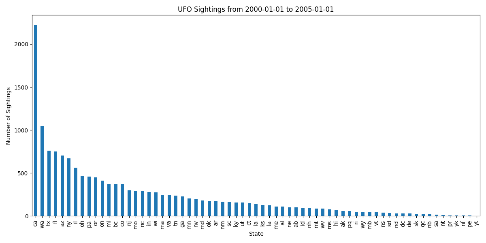

# Echoes of the Unknown

Final project yay! Now using the UFO Sightings dataset.

### Important Files:

The primary Python script is [api.py](api.py), which ingests the UFO sightings data using pandas and loads it into a Redis database. The user can use Flask routes to run the functions from the command line or through a browser, accessing the data and triggering analysis.

[docker-compose.yml](docker-compose.yml) is an important file that orchestrates Flask, Redis, and the worker environment which runs the async analysis script.

[Dockerfile](Dockerfile) and [requirements.txt](requirements.txt) work in conjunction to load a proper environment in which the user can run the scripts. Dockerfile defines the container setup, while requirements.txt lists the necessary Python dependencies.

The [jobs.py](jobs.py) script manages the queuing system and allows for jobs to be submitted, tracked, and managed via Redis.

[worker.py](worker.py) is the background service which listens for jobs and generates state-wise bar plots of UFO sightings over a given date range.

## Data Input
The UFO Sightings dataset is sourced from the [National UFO Reporting Center (NUFORC)](https://nuforc.org) and compiled by Sigmond Axel. 
It is hosted on [Kaggle](https://www.kaggle.com/datasets/NUFORC/ufo-sightings/data) and contains over 80,000 records of reported UFO sightings spanning the last century.

Each row includes:
- The datetime of the sighting
- The city, state, and country
- The shape of the UFO
- Duration in seconds and textual format
- Latitude and longitude
- Comments provided by witnesses

We store the CSV as `data/ufodata.csv`, and load it using the `/data` route.

## Getting Started 
### Deploying the App with Docker Compose
```
docker-compose up
```
This command utilizes docker-compose.yml to deploy Flask, Redis, and the worker container.

---

### Run Curl Commands and Interpretation

#### How to run POST /data
```
curl -X POST http://localhost:5000/data
```
Loads the UFO sightings data into Redis from `data/ufodata.csv`.

Example output:
```
"message": "Successfully loaded 80000 sightings"
```

#### How to run GET /data
```
curl -X GET http://localhost:5000/data
```
Returns all the data stored in Redis.

#### How to run DELETE /data
```
curl -X DELETE http://localhost:5000/data
```
Deletes all the data from Redis.
```
"message": "All data deleted"
```

#### How to run GET /sightings
```
curl http://localhost:5000/sightings
```
Returns all sighting IDs currently stored in Redis.

Example output:
```
["0", "1", "2", ..., "79999"]
```

#### How to run GET /sightings/<sighting_id>
```
curl http://localhost:5000/sightings/123
```
Returns the data associated with that specific sighting ID.

Example output:
```
{
  "datetime": "1/1/2000 00:00",
  "city": "phoenix",
  "state": "az",
  "country": "us",
  "shape": "circle",
  "duration (seconds)": "60",
  ...
}
```

---

### New Job Routes

Jobs analyze sightings within a given date range.

#### How to run POST /jobs
```
curl -X POST http://localhost:5000/jobs -H "Content-Type: application/json" -d '{"start_date":"2000-01-01", "end_date":"2005-12-31"}'
```
This creates a new job to analyze UFO sightings between the given dates.

Example output:
```
{
  "id": "a12cdef3-45gh-678i-910j-klmn123opqrs",
  "status": "submitted",
  "start_date": "2000-01-01",
  "end_date": "2005-12-31"
}
```

#### How to run GET /jobs
```
curl http://localhost:5000/jobs
```
Returns a list of all job IDs.

#### How to run GET /jobs/<jobid>
```
curl http://localhost:5000/jobs/a12cdef3-45gh-678i-910j-klmn123opqrs
```
Returns the job’s current status and metadata.

---

### How to Get Job Results

#### How to run GET /results/<jobid>
```
curl http://localhost:5000/results/a12cdef3-45gh-678i-910j-klmn123opqrs
```
Returns a JSON object with the title and a base64-encoded graph image.

To fetch the actual image as a PNG:
```
curl http://localhost:5000/results/a12cdef3-45gh-678i-910j-klmn123opqrs?format=image --output result.png
```
This saves the graph output locally as `result.png`.

Alternate method using `jq` and `base64` to decode and save the image:
```
curl http://<your_external_ip_or_url>/results/<jobid> \
  | jq -r .image_base64 \
  | base64 -d > result.png
```


Example result object:
```
{
  "job_id": "a12cdef3-45gh-678i-910j-klmn123opqrs",
  "title": "UFO Sightings from 2000-01-01 to 2005-12-31",
  "image_base64": "<base64 string>"
}
```

Example output image:


---


### Prompting it Outside via Public URL

Once deployed on Kubernetes and exposed via an Ingress, you can access the API at your public domain:
```
http://jasonlee.coe332.tacc.cloud
```

#### Direct Access in a Web Browser (GET routes only)
You can visit the following endpoints directly in any web browser:
- View all sightings:
  ```
  http://jasonlee.coe332.tacc.cloud/sightings
  ```
- View a specific sighting:
  ```
  http://jasonlee.coe332.tacc.cloud/sightings/0
  ```
- List all jobs:
  ```
  http://jasonlee.coe332.tacc.cloud/jobs
  ```
- View job metadata:
  ```
  http://jasonlee.coe332.tacc.cloud/jobs/<jobid>
  ```
- View job result metadata:
  ```
  http://jasonlee.coe332.tacc.cloud/results/<jobid>
  ```
- View result graph image (renders directly in browser):
  ```
  http://jasonlee.coe332.tacc.cloud/results/<jobid>?format=image
  ```

#### POST and DELETE Routes (use curl)

To load the data:
```
curl -X POST http://jasonlee.coe332.tacc.cloud/data
```

To submit a job:
```
curl -X POST http://jasonlee.coe332.tacc.cloud/jobs \
  -H "Content-Type: application/json" \
  -d '{"start_date":"2000-01-01", "end_date":"2005-12-31"}'
```

To delete all data:
```
curl -X DELETE http://jasonlee.coe332.tacc.cloud/data
```

#### Save Image Result via Public URL

If you want to save the result image from the public endpoint:
```
curl http://jasonlee.coe332.tacc.cloud/results/<jobid>?format=image --output result.png
```

Or using `jq` and `base64` for full manual control:
```
curl http://jasonlee.coe332.tacc.cloud/results/<jobid> \
  | jq -r .image_base64 \
  | base64 -d > result.png
```


---


---

## Kubernetes Deployment Instructions

To deploy this application to a Kubernetes cluster (such as Jetstream), use the following steps.

### Apply Deployment Files (Production)
Assuming you're in the project root directory:
```
kubectl apply -f kubernetes/prod/
```

### Check that Pods Are Running
```
kubectl get pods
```

### View Logs for Flask or Worker
```
kubectl logs <flask-pod-name>
kubectl logs <worker-pod-name>
```

### Port Forward (for local access)
Useful if you're testing without Ingress:
```
kubectl port-forward svc/app-prod-service-flask 5000:5000
```

Then visit:
```
http://localhost:5000/help
```

### Check Services
```
kubectl get svc
```

### Check Ingress for Public IP/Domain
```
kubectl get ingress
```

You should see your external IP or domain like `jasonlee.coe332.tacc.cloud` listed here.

---

## Redis Persistence: Backup and Restore

The use of `dump.rdb` as the Redis persistence file is part of the Jetstream development module, where test data is saved automatically during container runs.

### Backing up the Redis Database
Inside your Docker/Pod container, Redis stores data to a `dump.rdb` file. You can copy this file using:

**For Docker:**
```
docker cp <redis-container-name>:/data/dump.rdb ./redis-backup.rdb
```

**For Kubernetes:**
```
kubectl cp <redis-pod-name>:/data/dump.rdb ./redis-backup.rdb
```

This file contains the entire state of your Redis database and can be stored as a backup.

### Restoring the Redis Database
To restore a backup:
1. Stop the Redis container/pod.
2. Replace the current `dump.rdb` file with your backup:
   ```
   docker cp ./redis-backup.rdb <redis-container-name>:/data/dump.rdb
   ```
3. Restart the container or pod.

Redis will load the dump automatically on start.

## Running Unit and Integration Tests

This project includes test files compatible with `pytest` to ensure all core functionality works properly.

### Test Files:

- `test_api.py` — Tests API endpoints:
  - `/sightings`
  - `/sightings/<id>`
  - `/jobs`

- `test_jobs.py` — Tests the job creation system:
  - Submitting a job with a start/end date
  - Retrieving a job from Redis

- `test_worker.py` — Tests Redis integration with the results database:
  - Verifies connection to Redis DB 3 (where analysis results are stored)

### How to Run the Tests

If using Docker:
```
docker-compose up -d
pytest test/
```

If testing in Kubernetes (after deploying test configs):
```
kubectl exec -it <flask-pod-name> -- pytest test/
```

---

### Clean Up!

To stop and remove all running containers and clean up orphaned Docker resources:
```
docker-compose down --remove-orphans
docker rm -f `docker ps -aq`
```

This is helpful during development when you want to reset the environment or ensure no old containers are interfering with new changes.