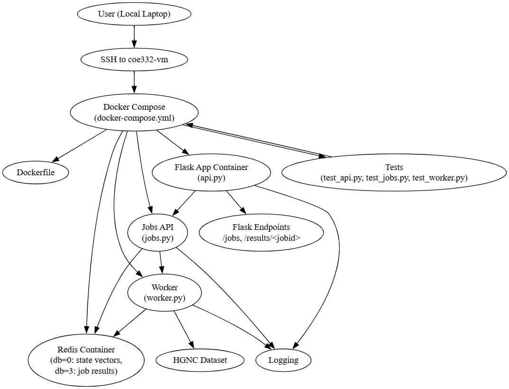

# Echoes of the Unknown

This project explores reported UFO sightings using a publicly available dataset. It was developed as part of the final project for COE 332: Software Engineering and Design.

## Team Members
- Jason Lee (jl78928)  
- Samarth Bhatt (skb3205)  
- Jesse Oh (jso687)

## System Architecture



The architecture includes three main services: a Flask API, a Redis data store, and a background worker for asynchronous job processing. This setup enables clean separation of concerns and scalability.

### Important Files:

The primary Python script is [api.py](api.py), which ingests the UFO sightings data using pandas and loads it into a Redis database. The user can use Flask routes to run the functions from the command line or through a browser, accessing the data and triggering analysis.

[docker-compose.yml](docker-compose.yml) is an important file that orchestrates Flask, Redis, and the worker environment which runs the async analysis script.

[Dockerfile](Dockerfile) and [requirements.txt](requirements.txt) work in conjunction to load a proper environment in which the user can run the scripts. Dockerfile defines the container setup, while requirements.txt lists the necessary Python dependencies.

The [jobs.py](jobs.py) script manages the queuing system and allows for jobs to be submitted, tracked, and managed via Redis.

[worker.py](worker.py) is the background service which listens for jobs and generates state-wise bar plots of UFO sightings over a given date range.

## Data Input
The dataset used is compiled by the National UFO Reporting Center (NUFORC) and was collected and published on Kaggle by Sigmond Axel. It contains over 80,000 reports spanning the past century.

Each record includes:
- Date and time of the sighting
- City, state, and country
- Shape of the UFO
- Duration in seconds and text format
- Latitude and longitude
- Witness comments

The dataset is stored in data/ufodata.csv and is loaded into the Redis database through the /data API endpoint.

We store the CSV as `data/ufodata.csv`, and load it using the `/data` route.

## Running the Application

### Option 1: Local Development (Docker Compose)
```
docker-compose up
```
This command utilizes docker-compose.yml to deploy Flask, Redis, and the worker container.

### Option 2: Kubernetes Deployment (Jetstream, etc.)
```
kubectl apply -f kubernetes/prod/
```
Use this to deploy the application into a Kubernetes cluster. See full instructions below under "Kubernetes Deployment Instructions."

---

### Run Curl Commands and Interpretation

#### How to run POST /data
```
curl -X POST http://localhost:5000/data
```
Loads the UFO sightings data into Redis from `data/ufodata.csv`.

Example output:
```
"message": "Successfully loaded 80000 sightings"
```

#### How to run GET /data
```
curl -X GET http://localhost:5000/data
```
Returns all the data stored in Redis.

#### How to run DELETE /data
```
curl -X DELETE http://localhost:5000/data
```
Deletes all the data from Redis.
```
"message": "All data deleted"
```

#### How to run GET /sightings
```
curl http://localhost:5000/sightings
```
Returns all sighting IDs currently stored in Redis.

#### How to run GET /sightings/<sighting_id>
```
curl http://localhost:5000/sightings/123
```
Returns the data associated with that specific sighting ID.

---

### New Job Routes

Jobs analyze sightings within a given date range.

#### How to run POST /jobs
```
curl -X POST http://localhost:5000/jobs -H "Content-Type: application/json" -d '{"start_date":"2000-01-01", "end_date":"2005-12-31"}'
```
Creates a job to analyze UFO sightings.

#### How to run GET /jobs
```
curl http://localhost:5000/jobs
```
Returns a list of all job IDs.

#### How to run GET /jobs/<jobid>
```
curl http://localhost:5000/jobs/<jobid>
```
Returns the job’s current status and metadata.

---

### How to Get Job Results

#### JSON:
```
curl http://localhost:5000/results/<jobid>
```

#### PNG Image:
```
curl http://localhost:5000/results/<jobid>?format=image --output result.png
```

#### Alternate (base64 decode):
```
curl http://<external>/results/<jobid> | jq -r .image_base64 | base64 -d > result.png
```

---

## Public Access via Ingress

If deployed via Kubernetes Ingress:
```
http://jasonlee.coe332.tacc.cloud
```

### Browser endpoints:
- `/sightings`
- `/sightings/<id>`
- `/jobs`
- `/jobs/<id>`
- `/results/<id>`
- `/results/<id>?format=image`

### Example curl via public domain:
```
curl -X POST http://jasonlee.coe332.tacc.cloud/data
curl -X POST http://jasonlee.coe332.tacc.cloud/jobs -H "Content-Type: application/json" -d '{"start_date":"2000-01-01", "end_date":"2005-12-31"}'
curl -X DELETE http://jasonlee.coe332.tacc.cloud/data
```

---

## Kubernetes Deployment Instructions

### Apply Deployment Files
```
kubectl apply -f kubernetes/prod/
```

### Check Pods
```
kubectl get pods
```

### View Logs
```
kubectl logs <flask-pod-name>
kubectl logs <worker-pod-name>
```

### Port Forward (Local Access)
```
kubectl port-forward svc/app-prod-service-flask 5000:5000
```
Then visit: `http://localhost:5000/help`

### Check Services
```
kubectl get svc
```

### Get Ingress
```
kubectl get ingress
```
You’ll see the public domain like `jasonlee.coe332.tacc.cloud`.

---

## Redis Persistence: Backup and Restore

### Backup Redis
```
docker cp <redis-container>:/data/dump.rdb ./redis-backup.rdb
kubectl cp <redis-pod>:/data/dump.rdb ./redis-backup.rdb
```

### Restore Redis
1. Stop Redis
2. Copy in your backup:
```
docker cp ./redis-backup.rdb <redis-container>:/data/dump.rdb
```
3. Restart Redis

---

## Running Tests

### Run with Docker:
```
docker-compose up -d
pytest test/
```

### Run in Kubernetes:
```
kubectl exec -it <flask-pod> -- pytest test/
```

---

## Clean Up
```
docker-compose down --remove-orphans
docker rm -f `docker ps -aq`
```
